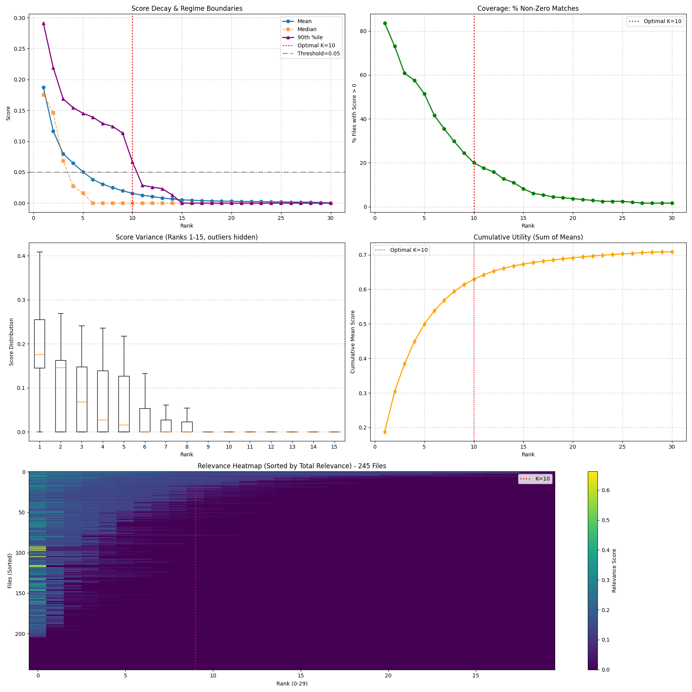

# AI-Harness for Credo

AI-Harness is a smart wrapper tool designed to automate the resolution of dependency errors when running `credo`. It executes a command, detects failures, uses an LLM (Gemini or OpenAI) to identify missing dependencies, installs them, and retries the execution. Upon success, it generates a "matcher" file that can be used by other tools to recognize and fix similar errors in the future.

## Features

*   **Automated Error Analysis**: Uses LLMs to parse error logs and identify missing system or language-specific dependencies.
*   **Multi-Model Support**: Supports both Google Gemini and OpenAI ChatGPT.
*   **Auto-Remediation**: Executes the suggested installation commands (e.g. `apt-get install`, `pip install`) and retries the original command.
*   **Pattern Learning**: Saves successful fixes as structured JSON "matcher" files in `./matchers`, compatible with the Credo ecosystem.

## Prerequisites

*   Go 1.21+
*   A valid [Google Gemini API Key](https://ai.google.dev/) OR [OpenAI API Key](https://platform.openai.com/)

## Installation

1.  Clone the repository (if you haven't already).
2.  Build the project using `make`:

```bash
make build
```

This will create the `ai-harness` binary in the root directory.

## Usage

1.  Set your API key. AI-Harness supports both Gemini and OpenAI.

**For Gemini (Default):**
```bash
export GEMINI_API_KEY="your_api_key_here"
```

**For OpenAI:**
```bash
export OPENAI_API_KEY="your_api_key_here"
```

**Precedence:**
If both keys are set, `GEMINI_API_KEY` takes precedence.

2.  Run your command through the harness:

```bash
./ai-harness [--model <model_name>] [--matchers <path>] <command> [arguments...]
```

**Example:**

```bash
./ai-harness credo {COMMAND}
```

**Example with custom options:**

```bash
# Use Gemini Pro and save matchers to a specific directory
./ai-harness --model gemini-1.5-pro --matchers ./my-matchers credo {COMMAND}

# Use GPT-4 Turbo
./ai-harness --model gpt-4-turbo credo {COMMAND}
```

### How it Works

1.  **Execution**: Runs the provided command.
2.  **Failure Detection**: If the command exits with a non-zero status, it captures `stdout` and `stderr`.
3.  **Analysis**: Sends the logs to the selected LLM to extract:
    *   A regex to match the error.
    *   The missing package(s).
    *   The package manager (e.g., `apt`, `pip`, `cran`).
    *   Immediate installation commands.
4.  **Remediation**: Runs the installation commands.
5.  **Retry**: Re-runs the original command with the new suggestions.
6.  **Learning**: If the retry succeeds, saves a JSON matcher file to the directory specified by `--matchers` (defaults to `./matchers`) so the fix is recorded for future use.

## Log Analysis & Experiments

This repository includes Python tools for advanced log analysis and parameter tuning:

*   **`log_analyzer.py`**: A standalone TF-IDF vectorizer for semantic search within log files.
*   **`process_logs.py`**: A batch processor that orchestrates the harness against a directory of logs, optionally utilizing the analyzer.
*   **`scripts/`**: Contains experimental scripts and requirements.
    *   **`experiment_k.py`**: A statistical tool to determine the optimal context window (Top-K chunks) for the LLM.

### Experiment Results


## Development

*   **Build**: `make build`
*   **Test**: `make test`
*   **Lint**: `make vet`
*   **Clean**: `make clean`
